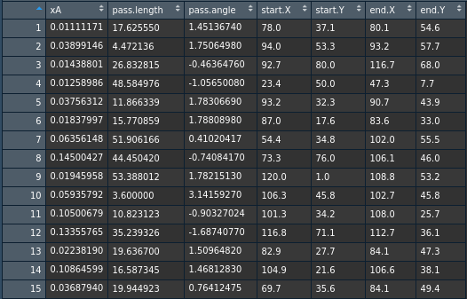
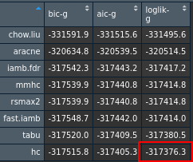
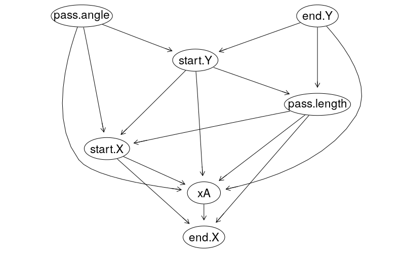
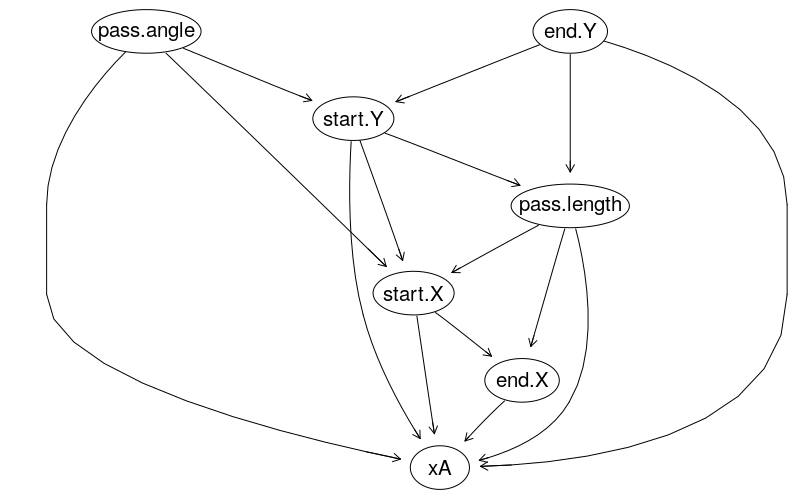
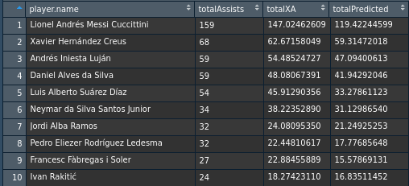
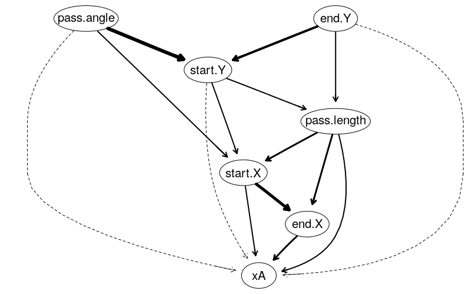

# Predicting_Assist_Value

Over the past few years, soccer analytics has been revolutionized; with better motion capture technology providing more detailed data, teams have been hard at work to take advantage of the data deluge that is currently available to them. Savvier data teams have been able to recruit better players, improve their own players by applying data driven training methods, and have a better understanding of their opponents' tactics. These improvements are a result of better analytics deployed to introduce new metrics that better capture the finer details of the sport. Perhaps one of the most important metrics that were introduced recently is the expected goal (xG) metric. Soccer is unique among team sports in its low scoring nature, something that complicates any statistical analysis applied to it. However, all is not lost, shots occur at a much higher rate (25 shots per game compared to 2.7 goals per game, as per http://www.footstats.co.uk/index.cfm?task=league_shots) and are therefore more pliant to analysis. xG is built on top of shots, it takes into account several aspects such as the position on the field from where the shot was taken, the body part the shot was taken with, as well as other factors. 

The same logic can be extended to assists, bringing us to the main topic of this analysis, the expected assists (xA) metric. xA tells us how likely it is that a pass will lead to a direct assist. It is a very valuable metric when assessing playmakers, since it gives a more holistic view of a player's abilities than a mere assist tally. According to this metric, a player with an xA value of 2 but with 0 actual assists is a better playmaker than a player with 1 actual assist but an xA value of 0.5 for example. This can be explained by the fact that a low xA pass can nevertheless be converted to a goal by a good striker, however that doesn't tell us much about the playmaking ability of the pass provider. On the other hand, a player with a high xA value but a low assist tally is someone who consistently provides good opportunities for his team mates who fail to take advantage of them.

In this analysis, we will be using statsbomb data to try and build a bayesian network model to predict the xA value of a pass. The dataset includes 15096 assists (observations), and 7 attributes describing each pass (xA value, pass length, pass angle, start X, start Y, end X, end Y). The data was collected from several compeitions, such as the English FA Women's league, Fifa World Cup 2018, as well as many others. The analysis is conducted over 5 phases:

* Phase 1 - Data loading  
* Phase 2 - Building the Bayesian Network models
* Phase 3 - Scoring the models
* Phase 4 - Visualization
* Phase 5 - Prediction and evaluation

## Phase 1 - Data Loading

There are few points that I would like to highlight regarding the dataset. The original data does not have an xA value. It does have the xG value for all shots, however. So, to create an xA value, I selected all shots, and for each shot I found the player who assisted it, and assigned the xG value to this player's (playmaker) xA. In other words, if a shot has an xG value of 0.3 (30% chance of being converted into a goal), then it follows that the pass preceding this shot has a 30% chance of being turned into an assist. Another thing that is important to note is the fact that I have only included numeric variables, as not all algorithms are flexible enough to accommodate mixed categories, specifically local discovery algorithms, unless we change all values to discrete, which I find illogical given the nature of the xA value (the target variable). The final dataset looks like this:    

  


## Phase 2 - Building the Bayesian Network Models

For the modelling phase, I used the following algorithms:

* Constraint-based: "iamb.fdr", "fast.iamb"
* Score-based: "hc", "tabu"
* Hybrid: "mmhc", "rsmax2"
* Local discovery: "aracne", "chow.liu"

Also, I have whitelisted all arcs going to the target variable (xA), to ensure their inclusion in the network. Leaving the networks to their own devices proved to be detrimental to the prediction phase, because some networks didn't include any arcs pointing to xA. Also, this step goes with the underlying wisdom of the xA metric, a metric that captures the value of a pass given its attributes.

## Phase 3 - Scoring

As mentioned above, the data has numeric variables only, therefore I had to use relevant scoring criteria, namely AIC-G, BIC-G, and LOGLIK-G.

The below table shows the different model scores:  



As highlighted, hc has the best score (maximum loglik-g), -317376.3.

## Phase 4 - Visualization

After identyfing the best algorithm, I now visualize the network using graphviz.plot():



I didn't like the fact that there is an arc going from xA to end.X (pass end position X-value), as I found it to be counterintuitive, the end position should determine the value of the pass, not the other way around. I reversed the direction of this arc and re-scored the model, getting a loglik-k score of -317378.7, still better than the other algorithms. Here is the modified network:



## Phase 5 - Prediction and Evaluation

1- Prediction:

First, we predict the xA value for all observations using the hc BN model

2- Evaluation:

I used MSE to evaluate the model's predictions, and I got the following scores:

Original HC (with arc from xA to end.X) = 0.01731002i  
Modified HC = 0.01446407

This justifies my decision to reverse the arc's direction.

The below table shows the aggregated predicted xA per player compared to the aggregated true xA and the aggregated assiste total for the top 10 players:



## Conclusion:

As shown in the above table, the model predictions discount the xA value, indicating that more work is needed for it to be deployable. Having more observations will help, but also error analysis is important, especially for players where the predicted xA is far off the mark. 

A model like this can be used to evaluate the playmaking ability of players. It could also help highlight the most important factors that determine a pass' quality, which can help trainers with setting up new training methods to improve these factors. To better demonstrate this last point, lets replot the network, but this time including the arc strength:



Analysing the arcs going to xA, we can see that the end.X arc is the strongest. Trainers could then analyse the vertical end locations of passes made by different players to identify the best spots a playmaker should try to pick, and devise new training methods that focus on passing the ball to these specific locations.

## APPENDIX 1 - Code

```
options(scipen=999)
library(StatsBombR)
library(dplyr)
library(bnlearn)

Comp <- FreeCompetitions()
ALLMATCHES <- FreeMatches(Comp)

# find common columns
col_counter <- data.frame(x=character(0), y=numeric(0), stringsAsFactors=FALSE)
colnames(col_counter) <- c('colname', 'colcount')
`%notin%` <- Negate(`%in%`)

for (i in ALLMATCHES$match_id){
  print(i)
  colz <- c(colnames(get.matchFree(filter(ALLMATCHES, match_id == i))))
  for (j in 1:length(colz)){
    if(colz[j] %notin% col_counter$colname){
      col_counter[nrow(col_counter) + 1,] = list(colz[j], 1)
    } else {
      col_counter$colcount[col_counter$colname == colz[j]] <- 
	col_counter$colcount[col_counter$colname == colz[j]]+1
    }
  }
}
colkeys <- col_counter$colname[col_counter$colcount == max(col_counter$colcount)]
write.csv(colkeys, 'colkeys.csv', row.names = FALSE)

# get match events
ALLEvents <- data.frame()
for (i in c(1:length(ALLMATCHES$match_id))){
  print(i)
  event <- select(get.matchFree(filter(ALLMATCHES, match_id == ALLMATCHES$match_id[i])), all_of(colkeys))
  event$match_name <- paste(filter(ALLMATCHES, match_id == ALLMATCHES$match_id[i])$home_team.home_team_name,
                            'v',
                            filter(ALLMATCHES, match_id == ALLMATCHES$match_id[i])$away_team.away_team_name) 
  event$match_date <- filter(ALLMATCHES, match_id == ALLMATCHES$match_id[i])$match_date
  event$xA <- NA
  eventXG <- event[!is.na(event$shot.key_pass_id),c('shot.key_pass_id','shot.statsbomb_xg')]
  event[event$id %in% eventXG$shot.key_pass_id,'xA'] <- 
	cbind(event[event$id %in% eventXG$shot.key_pass_id,c('xA','id')],eventXG)[,'shot.statsbomb_xg']
  xADataset_M <- event[!is.na(event$xA),]
  xADataset_M <- select(xADataset_M,
                        id,
                        player.name,
                        xA,
                        location,
                        play_pattern.name,
                        starts_with('pass'),
                        -pass.assisted_shot_id,
                        -pass.shot_assist,
                        -pass.recipient.id,
                        -pass.recipient.name,
                        -pass.height.id,
                        -pass.type.id,
                        -pass.body_part.id,
                        -pass.outcome.id,
                        -pass.cross,
                        -pass.switch,
                        -pass.type.name,
                        -pass.outcome.name
  )
  
  xADataset_M$start.X <- NA
  xADataset_M$start.Y <- NA
  xADataset_M$end.X <- NA
  xADataset_M$end.Y <- NA
  for (j in c(1:nrow(xADataset_M))){
    xADataset_M[j, 'start.X'] <- unlist(xADataset_M[j,'location'])[1]
    xADataset_M[j, 'start.Y'] <- unlist(xADataset_M[j,'location'])[2]
    xADataset_M[j, 'end.X'] <- unlist(xADataset_M[j,'pass.end_location'])[1]
    xADataset_M[j, 'end.Y'] <- unlist(xADataset_M[j,'pass.end_location'])[2]
  }
  xADataset_M <- select(xADataset_M, -location, -pass.end_location)
  
  # missing values
  apply(is.na(xADataset_M), 2, sum)
  xADataset_M[is.na(xADataset_M$pass.body_part.name),'pass.body_part.name'] <- 'Other'
  
  # handling categorical columns
  xADataset_M$play_pattern.name <- as.factor(xADataset_M$play_pattern.name)
  xADataset_M$pass.height.name <- as.factor(xADataset_M$pass.height.name)
  xADataset_M$pass.body_part.name <- as.factor(xADataset_M$pass.body_part.name)
  assistedShots <- 
	event[!is.na(event$shot.outcome.name) & event$shot.outcome.name=='Goal' & !is.na(event$shot.key_pass_id),]
  assists <- event[event$id %in% assistedShots$shot.key_pass_id,]
  xADataset_M$pass.outcome <- ifelse(xADataset_M$id %in% assists$id, 'Goal', 'No goal')
  ALLEvents <- rbind(ALLEvents, xADataset_M)
}
write.csv(ALLEvents, 'ALLEvents.csv', row.names = FALSE)

#########################################################################################################
# modelling
ALLEvents <- read.csv('ALLEvents.csv')
ALLEvents_HC <- ALLEvents[,c('xA','pass.length','pass.angle','start.X','start.Y','end.X','end.Y')]

v_algorithms <- c(
  "iamb.fdr","fast.iamb",
  "hc","tabu",
  "mmhc","rsmax2",
  "aracne","chow.liu"
)

list_bnlearn <- list()
whitelist = data.frame(
  from=colnames(ALLEvents_HC[-1]),
  to=rep('xA', ncol(ALLEvents_HC)-1)
)
for(j in v_algorithms) try({
  list_bnlearn[[j]] <- do.call(
    what = j,
    args = list(x = ALLEvents_HC, whitelist = whitelist)
  )
  M_arcs <- arcs(list_bnlearn[[j]])
  for(l in 1:nrow(M_arcs)){
    list_bnlearn[[j]] <- set.arc(
      x = list_bnlearn[[j]],
      from = M_arcs[l,1],
      to = M_arcs[l,2],
      check.cycles = FALSE,
      check.illegal = FALSE
    )
    list_bnlearn[[j]] <- choose.direction(
      x = list_bnlearn[[j]],
      arc = M_arcs[l,],
      data = ALLEvents_HC
    )
  }
},silent = TRUE)

#########################################################################################################
# scoring
scores_M <- c('loglik-g','aic-g','bic-g')
M_score <- matrix(
  data = NA,
  nrow = length(v_algorithms),
  ncol = length(scores_M),
)
rownames(M_score) <- v_algorithms
colnames(M_score) <- scores_M

for(j in v_algorithms) for(k in scores_M) try({
  M_score[j,k] <- score(
    x = list_bnlearn[[j]],
    data = ALLEvents_HC,
    type = k
  )
},silent=TRUE)
for(j in rownames(M_score)) M_score <- M_score[,order(M_score[j,])]
for(j in colnames(M_score)) M_score <- M_score[order(M_score[,j]),]
View(M_score)

max(M_score)
which.max(M_score)

#########################################################################################################
# plot
graphviz.plot(
  list_bnlearn[['hc']],
  shape='ellipse'
  )

list_bnlearn_modified <- reverse.arc(
  x = list_bnlearn[['hc']],
  from = "xA",
  to = "end.X",
  check.cycles = FALSE
)

score(
  x = list_bnlearn_modified,
  data = ALLEvents_HC,
  type = 'loglik-g'
)

graphviz.plot(
  list_bnlearn_modified,
  shape='ellipse'
)

#########################################################################################################
# predict
fitted_L <- list()
predictions <- list()
for (j in v_algorithms){
  fitted_L[[j]] = bn.fit(list_bnlearn[[j]], ALLEvents_HC)
  predictions[[j]] = predict(
    object=fitted_L[[j]],
    data=ALLEvents_HC[,-1],
    node='xA'
  )
}

fitted_L[['list_bnlearn_modified']] = bn.fit(list_bnlearn_modified, ALLEvents_HC)
predictions[['list_bnlearn_modified']] = predict(
  object=fitted_L[['list_bnlearn_modified']],
  data=ALLEvents_HC[,-1],
  node='xA'
)

# evaluate
hc_MSE <- ModelMetrics::mse(predictions[['hc']],ALLEvents_HC[,'xA'])
hc_Modified_MSE <- ModelMetrics::mse(predictions[['list_bnlearn_modified']],ALLEvents_HC[,'xA'])

predictedXA <- 
	data.frame(data.frame(ALLEvents[,c('id','player.name','xA',"pass.outcome")],
			predictions=predictions[['list_bnlearn_modified']]) %>%
  group_by(player.name) %>%
  summarise(totalAssists = n_distinct(id[pass.outcome=='Goal']),
            totalXA = sum(xA),
            totalPredicted = sum(predictions)
  ) %>%
  arrange(desc(totalAssists)))
View(predictedXA)

# arc strength
arc.strength_xA <- arc.strength(
  x = list_bnlearn_modified,
  data = ALLEvents_HC
)

strength.plot(
  x = list_bnlearn_modified,
  strength = arc.strength_xA,
  shape='ellipse'
)

#########################################################################################################
```
